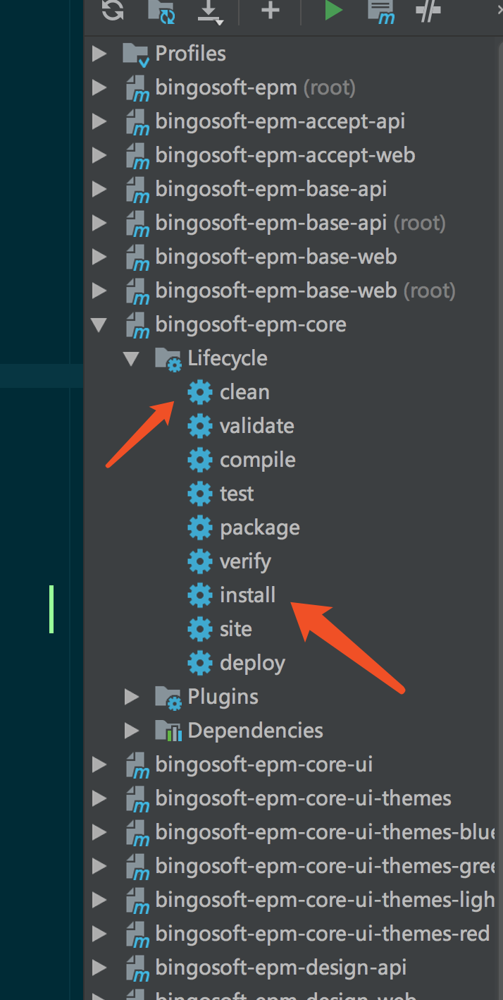
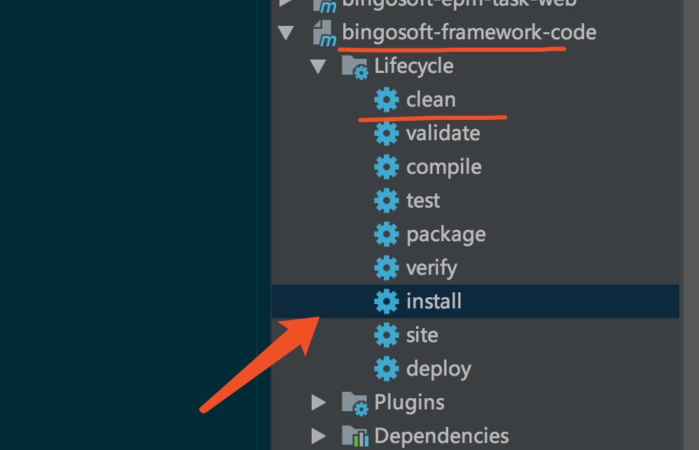
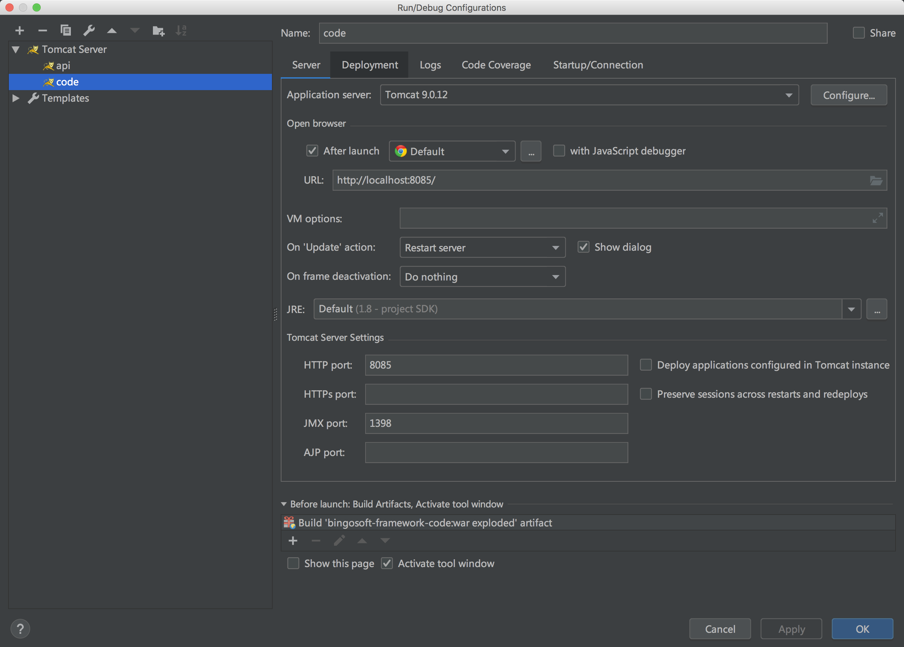
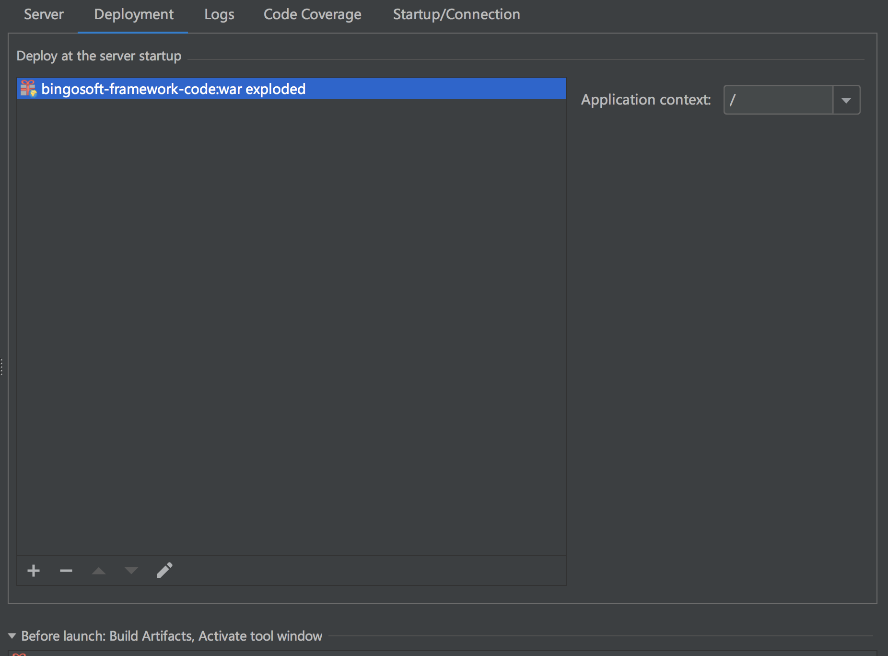

# 代码生成
代码生成器是作为效率工具的存在，这个比较简单

## 代码生成器地址
代码生成器一个模块存在，作为一个单独的存在独立出来 
 
bingosoft-framework-code
[公网地址](http://47.107.185.156:8090/)
## 代码生成器使用

1、  bingosoft-framework-code 作为一个单独的模块运行 改配置

bingosoft-framework-code/src/main/resources/conf/config/jdbc.xml

``` xml
	<properties>
		<property name="jdbc.driverClassName">oracle.jdbc.driver.OracleDriver</property>
		<property name="jdbc.url">jdbc:oracle:thin:@(DESCRIPTION=(ADDRESS=(PROTOCOL=TCP)(HOST=47.107.171.54)(PORT=1521))(CONNECT_DATA=(SERVER=DEDICATED)(SERVICE_NAME=orcl)))</property>
		<property name="jdbc.username">EPM_LZ</property>
		<property name="jdbc.password">EPM_LZ</property>
	</properties>
```

2、maven重新编译 

<div align="center">
    
</div> 

<div align="center">
    
</div> 

3、tomcat直接启动

<div align="center">
    
</div> 

<div align="center">
    
</div> 

打开例子之中的代码生成器 `http://localhost:8085/`

4、复制代码
ctrl+c 之后直接对这个包，ctrl+v，就会自动生成文件了

> 模板可以随时改，但是这里就不提了。


>  参考 http://47.107.185.156:8078


